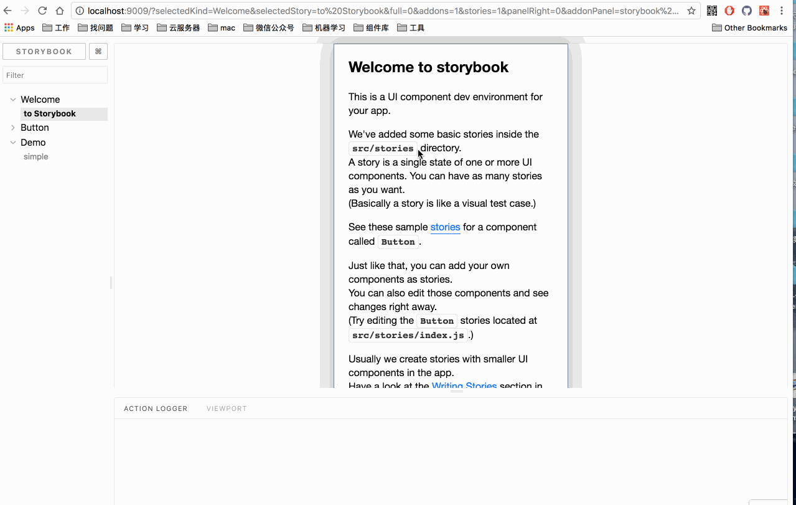
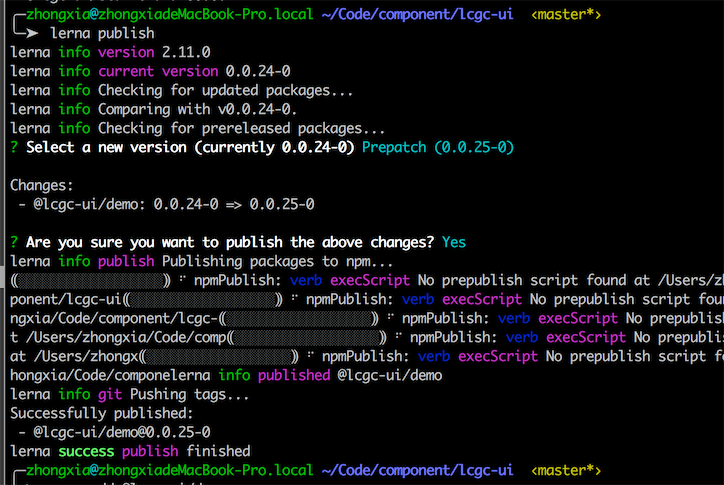

# React 组件库脚手架

React + Storybook + Lerna 构建自己的前端 UI 组件库。

React 是目前非常流行的一个前端框架,组件化，虚拟 Dom，丰富的生态圈，能够快速的开发和更好的维护前端项目。

StoryBook 是一套 UI 组件的开发环境，它允许你浏览组件库，查看每个组件的不同状态，以及交互式开发和测试组件。

Lerna 帮你管理你的包集合，当你自己的 library 变多时，你的版本控制，跟踪管理，测试就会变得越发复杂，lerna 正是帮你解决这个问题，它使用 npm 和 git 来帮助你优化你的多包管理流程。

该脚手架支持你快速的开发 React 组件，并且能够很方便的查看效果（PC 和 mobile 效果即可），编写文档, 以及 npm 包版本控制，跟踪管理。

## 一、文档

* [REMADME](./doc/README.md)
* [快速开始](./doc/GET_START.md)
* [常见问题](./doc/ISSUE.md)
* [React + Storybook + Lerna 构建自己的前端 UI 组件库](https://juejin.im/post/5a8a905c6fb9a06350151e4c)

> 该项目根据 [ 这篇文章](https://juejin.im/post/5a8a905c6fb9a06350151e4c) 来创建出来的项目，中间遇到了一些问题，也解决了这些问题，最终把项目跑起来了。

## 二、 效果

storybook 效果

lerna publish 部署效果

